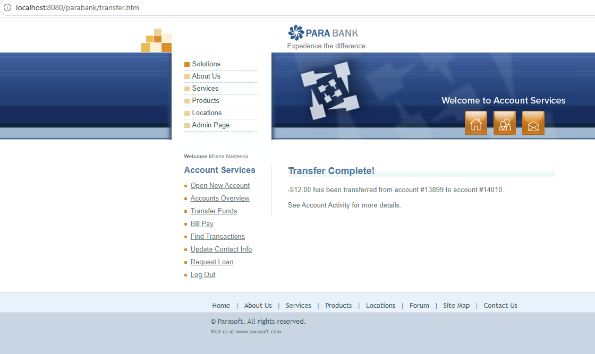
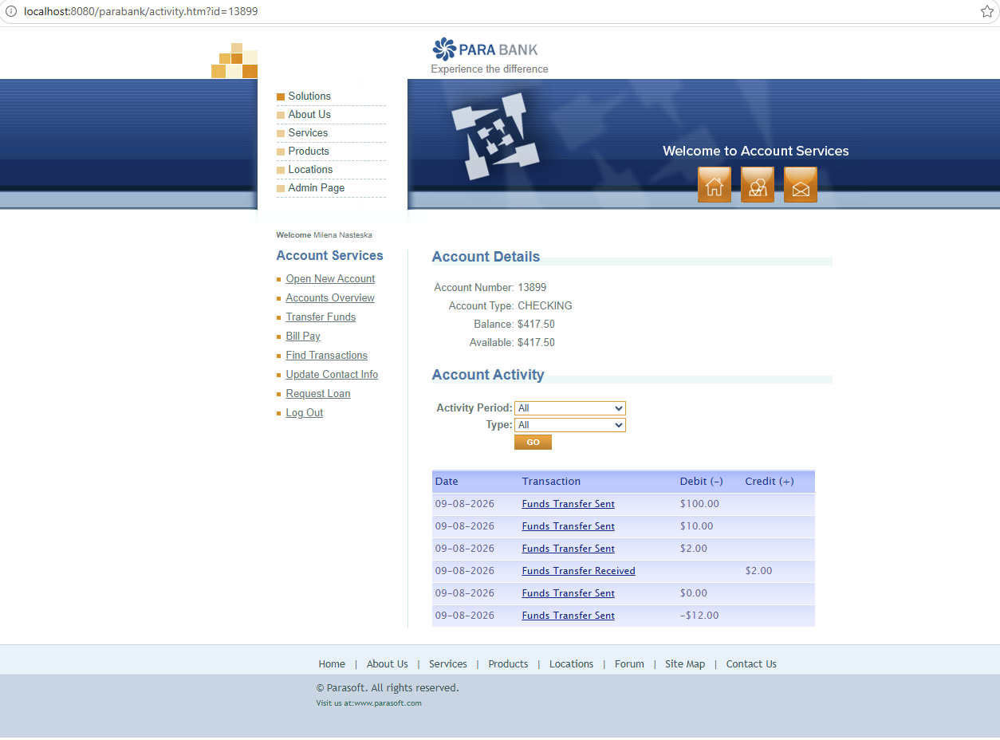
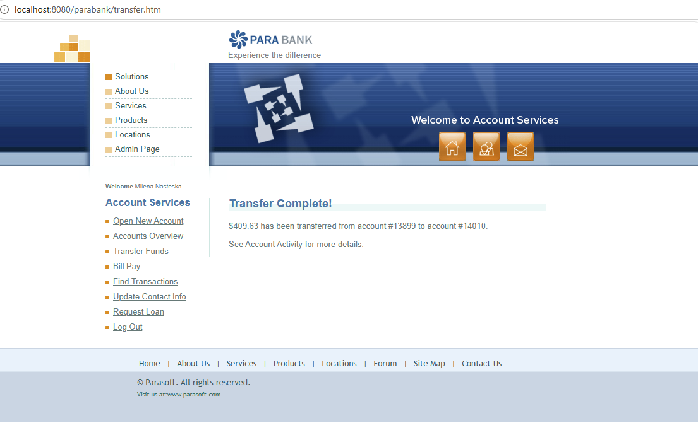
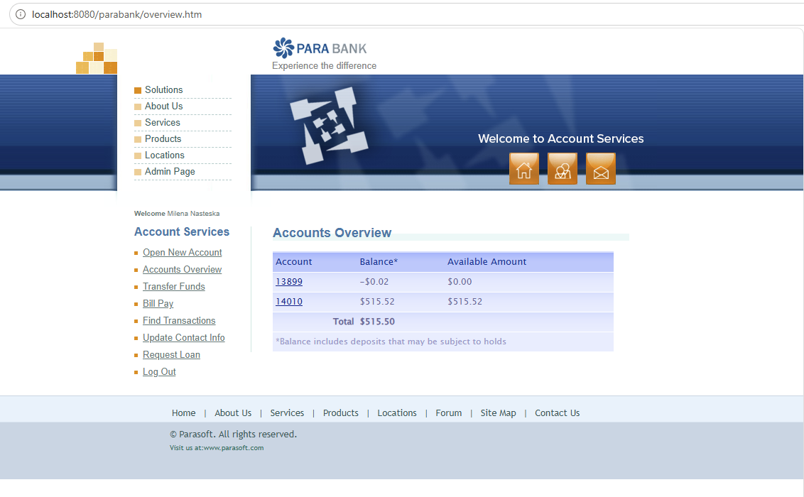

# Bug Reports 

From the several issues identified during manual testing of the Transfer Funds feature in the ParaBank app, I'd raise the following two:  
- Negative funds transfer is accepted and processed successfully  
- Transfer amount greater than the available balance is allowed and results in negative balance  

---

## BUG-001 - Negative transfer amount is accepted and processed successfully

**Severity:** High  
**Priority:** High

### Preconditions
- The user is registered and logged in
- The user has at least two accounts
- The source and the destination account balances are known

### Steps to Reproduce
1. Click on **Transfer Funds**
2. Enter a negative amount, for example "-$12"
3. Select different From and To accounts
4. Click on **Transfer**
5. Click on **Accounts Overview**
6. Notice the balances of the source and destination accounts

### Expected Result
The transfer should not be processed when the entered amount is negative

An appropriate validation message should be displayed and the source and destination account balances should remain unchanged

### Actual Result
The negative amount is accepted, and the transfer is processed successfully in the opposite direction instead of being rejected

When "$12" is transferred:
- The source account balance is increased by "$12" 
- The destination account balance is decreased by "$12" 

### Screenshots:

---

## BUG-002 - Transfer amount greater than available balance is allowed and results in negative balance

**Severity:** High  
**Priority:** High

### Preconditions
- The user is registered and logged in
- The user has at least two accounts
- The available balance of the source account is known, e.g. $409.61

### Steps to Reproduce
1. Open **Accounts Overview**
2. Note the current balance of the account that will be used as the source account
3. Click on **Transfer Funds** menu
4. Enter an amount greater than the available balance of the source account, e.g. $409.63
5. Select the source account in the From account field
6. Select a different account in the To account field
7. Click on **Transfer**
8. Click on **Accounts Overview**
9. Check the source account balance

### Expected Result
The transfer should be rejected when the amount exceeds the available balance, unless going in negative balance is explicitly supported  
An appropriate validation message should be displayed and the source account balance should not become negative

### Actual Result
The transfer is completed successfully even though the transfer amount exceeds the available balance
The source account balance becomes negative

**Example observed balance:** "-$0.02"

### Screenshots
 

