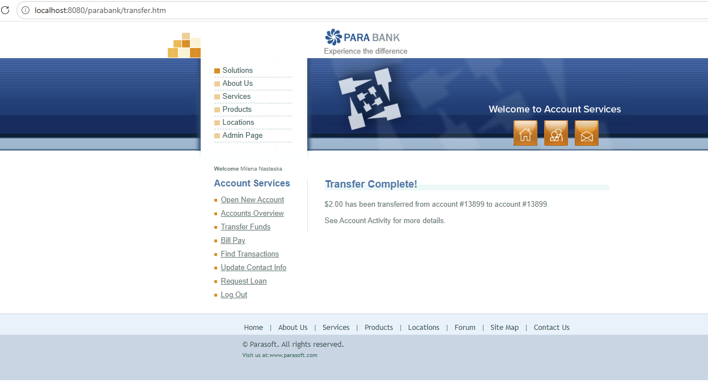
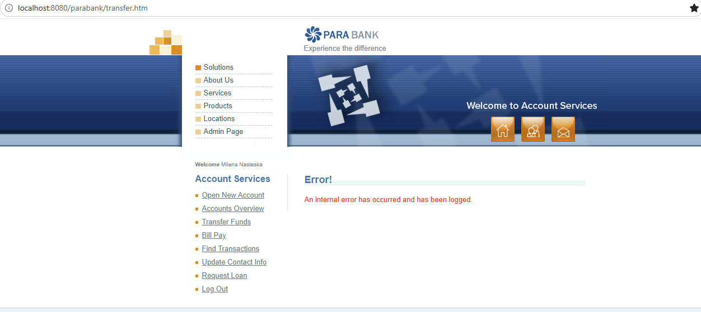
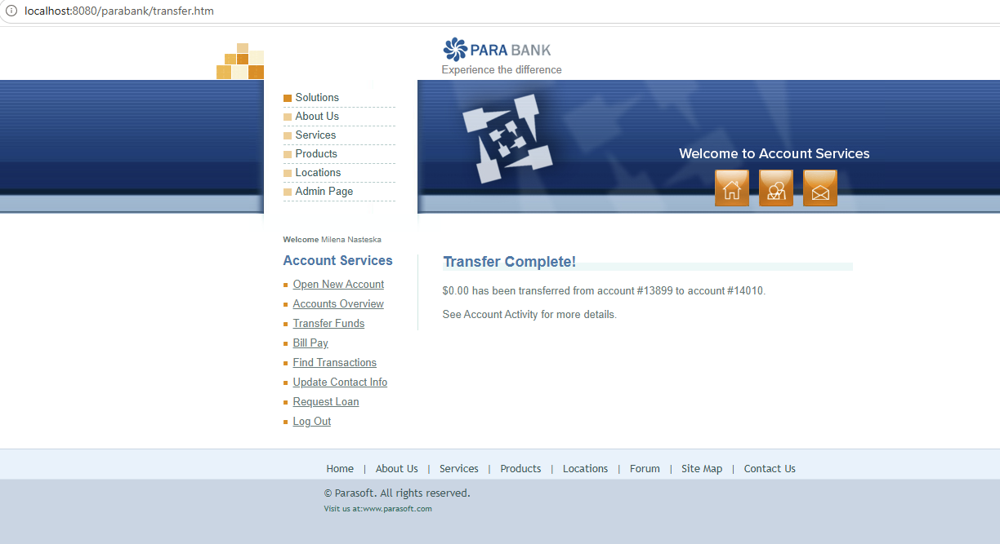
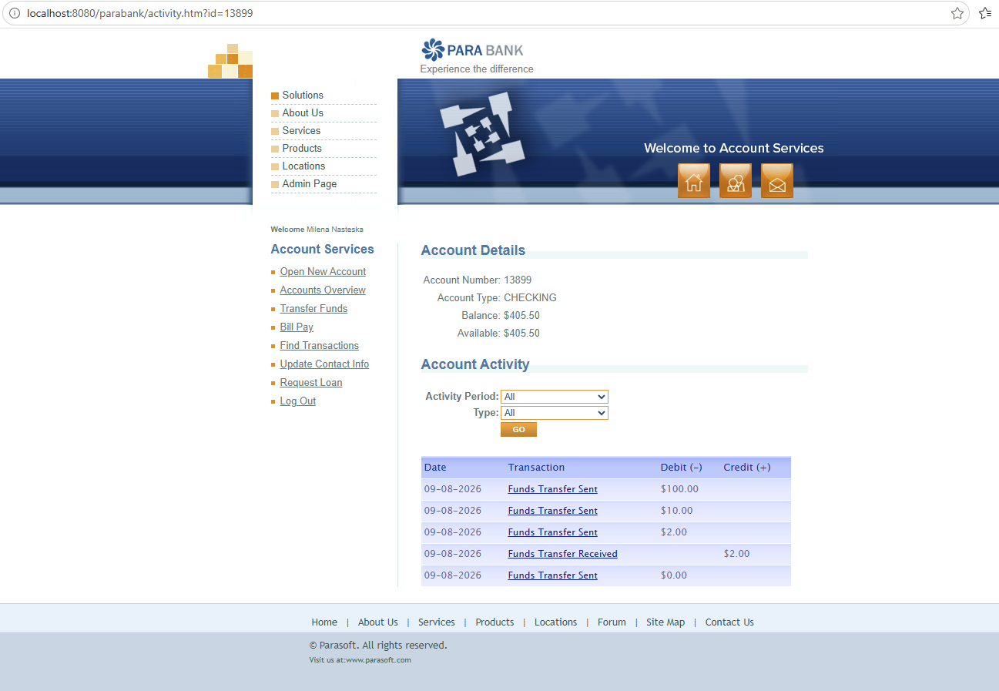
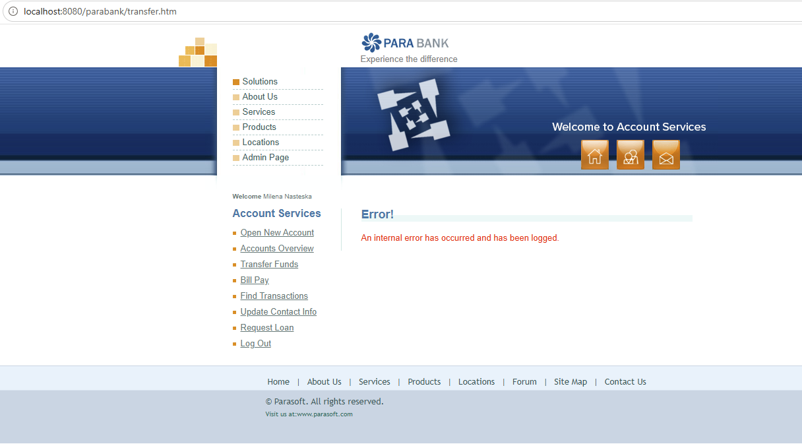
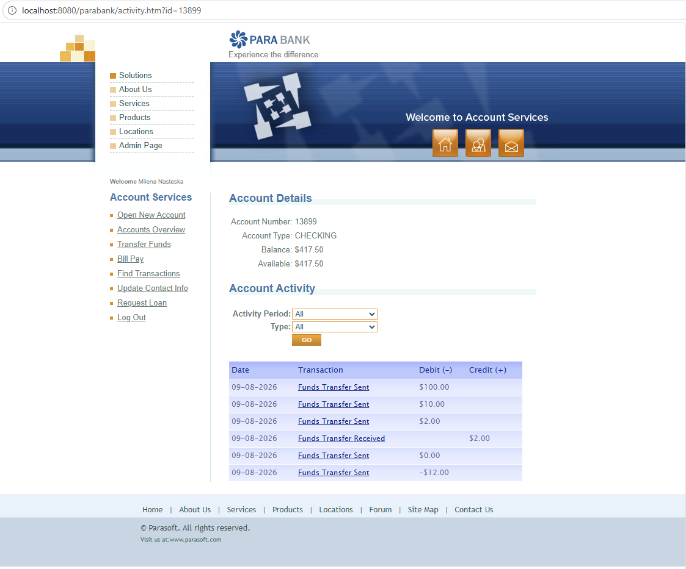
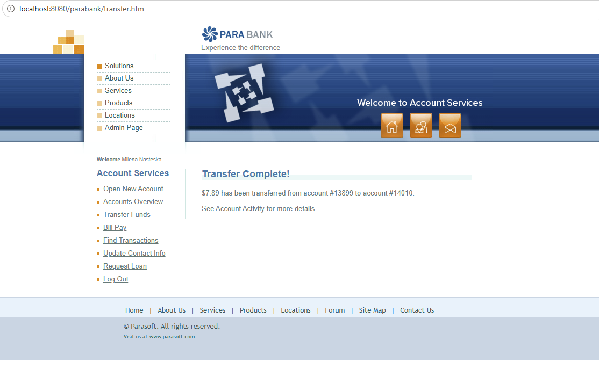
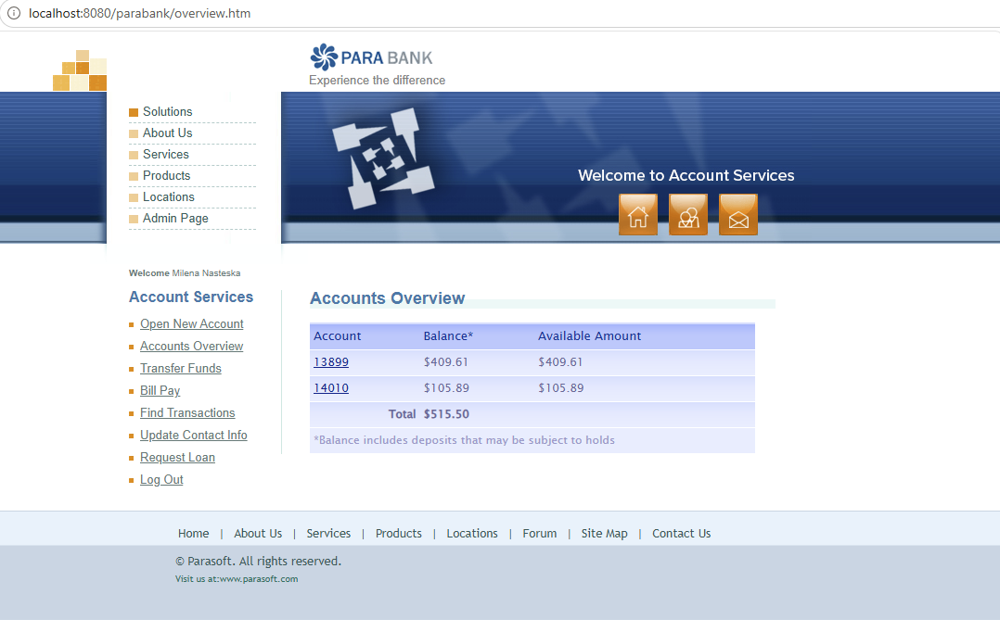

# Transfer Funds - Manual Test Cases

## Preconditions
- User is registered and logged in
- User has at least two accounts:  
  Create a new account via **Open New Account** action
- Source account has sufficient balance to transfer funds

---

## TF-001 - Transfer funds successfully between two different accounts

**Priority:** High

**Steps:**
1. Click on **Transfer Funds**  
**Expected Result:** The transfer funds screen is displayed: **Amount** field shows blank by default, **From** and **To** drop-down fields display the original account number

3. Enter a valid positive numeric value in the **Amount** field  
**Expected Result:** The amount value is accepted and shows in the field

5. Select different **From account** and **to account** accounts  
**Expected Result:** Different accounts are selected in the **From account** and **to account** fields

7. Click **Transfer**  
**Expected Result:** "**Transfer Complete!**" message is displayed with the followign info: "$ [amountValue] has been transferred from account # [accountNumber] to account # [accountNumber]. See Account Activity for more details."

**Test Data:**  
Amount: $10.00

**Screenshot:** 

---

## TF-002 - Verify account balances and transaction history in Accounts Overview after a successful transfer

**Priority:** High

**Preconditions:**
- User is registered and logged in
- User has at least two accounts
- A successful transfer has been completed between the two different accounts
- The transferred amount is known, e.g. $10.00

### Steps:

1. Click on **Accounts Overview**  
   **Expected Result:** The Accounts Overview page is displayed and both original and newly created accounts are listed

2. Check the balance of the source account from which you deducted the funds  
   **Expected Result:** The source account balance is decreased by the transferred amount

3. Check the balance of the destination account where you transferred funds  
   **Expected Result:** The destination account balance is increased by the transferred amount

4. Click on the account number of the source account and check the Transaction log  
   **Expected Result:** Under the **Account Details** info, in the **Account Activity** section the **Funds Transfer Sent** transaction log is displayed, date stamp is displayed and the amount shows in the **Debit (-)** column

**Test Data:**  
Transferred amount: $10.00

**Screenshot:** 

---

## TF-003 - Transfer funds to the same account

**Priority:** Medium

**Steps:**
1. Click on **Transfer Funds**  
 **Expected Result:** The **Transfer Funds** screen is displayed and shows the fields in their default state
   
3. Enter a valid positive numeric value in the **Amount** field  
 **Expected Result:** The amount value is accepted and shows in the field
   
5. Select the same account in both **From account** and **to account** drop-down fields  
**Expected Result:** The same account is selected in both  **From account** and **to account** drop-down fields

7. Click Transfer  
**Expected Result:** The transfer is rejected and there is an appropriate user-friendly message informing you that funds can't be transferred to the same account (It does not make sense)

9. Navigate to **Accounts Overview** and check the selected account balance  
**Expected Result:** The account balance remains unchanged and there is no transfer transaction recorded 

**Test Data:**  
Amount: $10.00

**Screenshot:** 

**NOTE:**  
The transaction goes through without errors, and this needs to have a bug logged if the acceptance criteria clearly states that the user should not:
- transfer funds where source and destination account is the same 
- transfer funds where the amount is negative number, zero
- transfer funds should have defined minimum and maximum values for **Amount** and the user should not be allowed to transfer funds greater/lower than the limit values 
- the currency should be clearly defined in the acceptance criteria as well should the user have different accounts with different currencies 

---

## TF-004 - Transfer with an empty amount

**Priority:** High

**Steps:**
1. Click on **Transfer Funds**  
**Expected Result:** The **Transfer Funds** screen is displayed and shows the fields in their default state

3. Leave the **Amount** field empty  
**Expected Result:** The **Amount** field is left empty

5. Select different From and To accounts  
**Expected Result:** Different account number is selected in **From account** and **to account** fields

7. Click on **Transfer**
**Expected Result:** The Transfer** button is either disabled until a value is provided in **Amount** field or there is a validation message displayed indicating that a valid amount is required to proceed with transfer

**Actual Result:** "An internal error has occurred and has been logged." message is displayed  
**NOTE:** Needs logging of a bug 

**Screenshot:** 

---

## TF-005 - Transfer a zero amount

**Priority:** High

### Steps:

1. Click on **Transfer Funds**  
   **Expected Result:** The **Transfer Funds** screen is displayed and shows the fields in their default state

2. Enter "0" in the **Amount** field  
   **Expected Result:** The value "0" is entered in the **Amount** field

3. Select different account numbers in **From account** and **to account**  
   **Expected Result:** The selected source and destination accounts are displayed correctly

4. Click **Transfer**  
   **Expected Result:** The transfer is not completed and a validation message is displayed indicating that the amount must be greater than zero.

5. Check the account balances  
   **Expected Result:** The source and destination account balances remain unchanged

**Screenshot:** 

Account Activity after zero Amount transfer:  

---

## TF-006 - Transfer a negative amount

**Priority:** High

### Steps:

1. Open **Transfer Funds**  
   **Expected Result:** The Transfer Funds screen is displayed and shows the fields in their default state

2. Enter a negative value in the **Amount** field, for example "-12"  
   **Expected Result:** The negative value is entered in the **Amount** field

3. Select different From and To accounts  
   **Expected Result:** The selected source and destination accounts are displayed correctly

4. Click **Transfer**  
   **Expected Result:** The transfer is not completed and a validation message is displayed indicating that the amount must be greater than zero

5. Check the account balances  
   **Expected Result:** The source and destination account balances remain unchanged

 **Actual Result:** **The Transfer is completed! Transferring negative amount (-$12) from account #13899 to account #14010 results in increasing the balance of account #13899 by $12 and decreasing the balance of account #14010**
 
 **NOTE:** This requires logging a high severity bug. Would be critical if the accounts belong to two different people 

**Screenshot:** 
Transfer with negative amount:  

Account Activity after transfer with negative amount:  

---

## TF-007 - Transfer a non-numeric amount

**Priority:** High

### Steps:

1. Click on **Transfer Funds**  
   **Expected Result:** The Transfer Funds screen is displayed and shows the fields in their default state

2. Enter a non-numeric value in the **Amount** field, for example "abc"  
   **Expected Result:** The app either does not accept non-numeric input in the **Amount** field or accepts the input and shows a validation message when clicking on **Transfer** (**NOTE:** ideally should not accept the non-numeric input at all. Need to check what happens with exponential notations)

3. Select different From and To accounts  
   **Expected Result:** The selected source and destination accounts are displayed correctly

4. Click on **Transfer**  
   **Expected Result:** The transfer is not completed and an appropriate validation message is displayed for the invalid amount
   **Actual Result:** "Error! An internal error has occurred and has been logged." Network tab in dev console shows 400 Error - Bad Request

 **NOTE:** This requires raising a bug 

6. Check the account balances  
   **Expected Result:** The source and destination account balances remain unchanged

**Screenshot:** 
Transfer with non-numeric amount:  

Account Activity after transfer with non-numeric amount:  

---

## TF-008 - Transfer a valid decimal amount

**Priority:** Medium

### Steps:

1. Click on **Transfer Funds**  
   **Expected Result:** The Transfer Funds screen is displayed and shows the fields in their default state

2. Enter a valid decimal amount, for example "7.89"  
   **Expected Result:** The decimal value is accepted and displayed correctly in the **Amount** field

3. Select different From and To accounts  
   **Expected Result:** The selected source and destination accounts are displayed correctly

4. Click on **Transfer**  
   **Expected Result:** The transfer is completed successfully and a confirmation message is displayed

5. Open **Accounts Overview**. 
   **Expected Result:** The source account balance is decreased by "7.89" and the destination account balance is increased by "7.89"

**Screenshot:** 
Transfer with valid decimal amount:  

Account Overview after transfer with decimal amount:  

---

## TF-009 - Transfer an amount greater than the available balance

**Priority:** High

**Precondition:** Source account balance is known.

### Steps:

1. Click on **Accounts Overview**, notice and remember the available balance of the source account  
   **Expected Result:** The current balance of the source account is displayed

2. Click on **Transfer Funds**  
   **Expected Result:** The Transfer Funds screen is displayed and shows the fields in their default state

3. Enter an amount greater than the available balance of the source account, e.g. in this case $409.63  
   **Expected Result:** The entered amount is displayed in the **Amount** field

4. Select the account with lower balance than the entered amount in the **From** account and a different account in the **To** account  
   **Expected Result:** The selected source and destination accounts are displayed correctly

5. Click on **Transfer**  
   **Expected Result:** The transfer is not completed and an appropriate validation message for insufficient available balance is displayed
   **Actual Result:** The transfer is completed successfully even though the transfer amount exceeds the available balance and the source account balance becomes negative, in this case -$0.02

7. Check the account balances. 
   **Expected Result:** The source and destination account balances remain unchanged
   **Actual Result:** The source account balance becomes negative, in this case -$0.02, and the destination account balance increases, in this case by $409.63 (see the screenshots below)

**Screenshot:** 
Transfer amount greater than the available balance:  

Accounts Overview after transfer of amount greater than the available balance:  

**NOTE:** This requires raising a bug 

---

## TF-010 - Verify account balances are updated correctly after a successful transfer

**Priority:** High

**Precondition:** A successful transfer has been completed between two different accounts and the original balances are known.

### Steps:

1. Open **Accounts Overview**. 
   **Expected Result:** The Accounts Overview screen is displayed and both accounts are listed.

2. Check the balance of the source account. 
   **Expected Result:** The source account balance is decreased by exactly the transferred amount.

3. Check the balance of the destination account. 
   **Expected Result:** The destination account balance is increased by exactly the transferred amount.

4. Verify the total balance across the user's accounts, if displayed. 
   **Expected Result:** The total balance remains unchanged because the funds were transferred between the user's own accounts.

---

## TF-010 - Verify successful transfer is recorded in transaction history

**Priority:** High

**Precondition:** A successful transfer has been completed and the transfer amount is known.

### Steps:

1. Open **Accounts Overview**. 
   **Expected Result:** The Accounts Overview screen is displayed.

2. Open the source account used in the transfer. 
   **Expected Result:** The account details and transaction history are displayed.

3. Locate the recently completed transfer. 
   **Expected Result:** A transaction corresponding to the transferred amount is present in the source account history.

4. Verify the transaction details. 
   **Expected Result:** The transaction shows the correct amount and is recorded as an outgoing transfer/debit.

5. Open the destination account. 
   **Expected Result:** The destination account details and transaction history are displayed.

6. Locate the corresponding incoming transfer. 
   **Expected Result:** A transaction for the same amount is present and recorded as an incoming transfer/credit.
