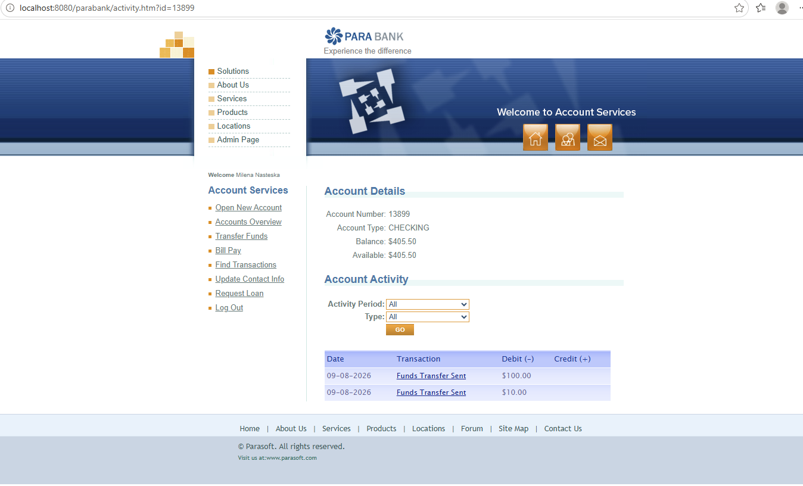

# Transfer Funds - Manual Test Cases

## Preconditions
- User is registered and logged in
- User has at least two accounts:  
  Create a new account via **Open New Account** action
- Source account has sufficient balance to transfer funds

---

## TF-001 - Transfer funds successfully between two different accounts

**Priority:** High

**Steps:**
1. Click on **Transfer Funds**  
**Expected Result:** The transfer funds screen is displayed: **Amount** field shows blank by default, **From** and **To** drop-down fields display the original account number
2. Enter a valid positive numeric value in the **Amount** field  
**Expected Result:** The amount value is accepted and shows in the field
4. Select different **From account** and **to account** accounts  
**Expected Result:** Different accounts are selected in the **From account** and **to account** fields
5. Click **Transfer**  
**Expected Result:** "**Transfer Complete!**" message is displayed with the followign info: "$ [amountValue] has been transferred from account # [accountNumber] to account # [accountNumber]. See Account Activity for more details."

**Test Data:**  
Amount: $10.00

**Screenshot:** 

---

## TF-002 - Verify account balances and transaction history in Accounts Overview after a successful transfer

**Priority:** High

**Preconditions:**
- User is registered and logged in
- User has at least two accounts
- A successful transfer has been completed between the two different accounts
- The transferred amount is known, e.g. $10.00

### Steps:

1. Click on **Accounts Overview**  
   **Expected Result:** The Accounts Overview page is displayed and both original and newly created accounts are listed

2. Check the balance of the source account from which you deducted the funds  
   **Expected Result:** The source account balance is decreased by the transferred amount

3. Check the balance of the destination account where you transferred funds  
   **Expected Result:** The destination account balance is increased by the transferred amount

4. Click on the account number of the source account and check the Transaction log  
   **Expected Result:** Under the **Account Details** info, in the **Account Activity** section the **Funds Transfer Sent** transaction log is displayed, date stamp is displayed and the amount shows in the **Debit (-)** column

**Test Data:**  
Transferred amount: $10.00

**Screenshot:** 

---

## TF-003 - Attempt to transfer funds to the same account

**Priority:** Medium

**Steps:**
1. Click on **Transfer Funds**  
 **Expected Result:** The Transfer Funds screen is displayed and shows the fields in their default state
2. Enter a valid positive numeric value in the **Amount** field  
 **Expected Result:** The amount value is accepted and shows in the field
3. Select the same account in both **From account** and **to account** drop-down fields  
**Expected Result:** The same account is selected in both  **From account** and **to account** drop-down fields
4. Click Transfer  
**Expected Result:** The transfer is rejected and there is an appropriate user-friendly message informing you that funds can't be transferred to the same account
5. Navigate to **Accounts Overview** and check the selected account balance
**Expected Result:** The account balance remains unchanged and there is no transfer transaction recorded 

**Test Data:**  
Amount: $10.00

**NOTE:**  
The transaction goes through without errors, and this needs to have a bug logged if the acceptance criteria clearly states that the user should not:
- transfer funds where source and destination account is the same 
- transfer funds where the amount is negative number, zero
- transfer funds should have defined minimum and maximum values for **Amount** and the user should not be allowed to transfer funds greater/lower than the limit values 
- the currency should be clearly defined in the acceptance criteria as well should the user have different accounts with different currencies 

---

## TF-004 - Attempt transfer with an empty amount

**Priority:** High

**Steps:**
1. Open Transfer Funds.
2. Leave the Amount field empty.
3. Select different From and To accounts.
4. Click Transfer.

**Expected Result:**  
The transfer is not completed. The account balances remain unchanged and validation is displayed indicating that a valid amount is required.
